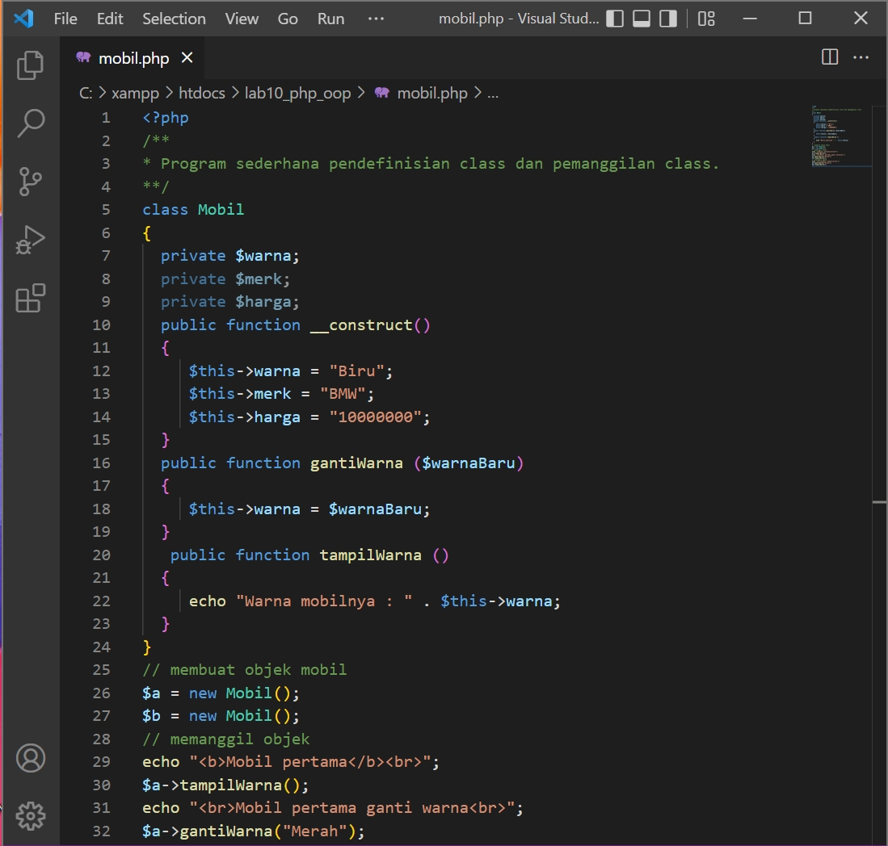

# 10_Lab10Web

TUGAS PERTEMUAN 11

PEMROGRAMAN WEB

TEKNIK INFORMATIKA

UNIVERSITAS PELITA BANGSA

NAMA  : GUNAWAN

NIM   : 312010191

KELAS : TI.20.B1

DOSEN : Agung Nugroho,S.Kom.,M.Kom

# Pemrograman Web: PHP OOP

**Instruksi Praktikum**
1. Persiapkan text editor misalnya **VSCode**. 
2. Buat folder baru dengan nama **lab10_php_oop** pada docroot webserver
(htdocs)
3. Ikuti langkah-langkah praktikum yang akan dijelaskan berikutnya.  

**Menjalankan MySQL Server** 
Untuk menjalankan MySQL Server dari menu XAMPP Contol.

Gambar 01. XAMPP Control

Buat folder **lab10_php_oop** pada root directory web server (C:\xampp\htdocs)

Gambar 02. Directory Lab10

**Langkah-langkah Praktikum** 
Buat file baru dengan nama **mobil.php**. 
~~~
<?php
/**
* Program sederhana pendefinisian class dan pemanggilan class.
**/
class Mobil
{
private $warna;
private $merk;
private $harga;
public function __construct()
{
$this->warna = "Biru";
$this->merk = "BMW";
$this->harga = "10000000";
}
public function gantiWarna ($warnaBaru)
{
$this->warna = $warnaBaru;
}
public function tampilWarna ()
{
echo "Warna mobilnya : " . $this->warna;
}
}
// membuat objek mobil
$a = new Mobil();
$b = new Mobil();
// memanggil objek
echo "<b>Mobil pertama</b> ";
$a->tampilWarna();
echo " Mobil pertama ganti warna ";
$a->gantiWarna("Merah");
$a->tampilWarna();
// memanggil objek
echo " <b>Mobil kedua</b> ";
$b->gantiWarna("Hijau");
$b->tampilWarna();
?>
~~~

Gambar 03. Code mobil

Kemudian untuk mengakses direktory tersebut pada web server dengan mengakses URL: 
http://localhost/lab10_oop/mobil.php

Gambar 04. Tampilan Web mobil

Buat file baru dengan nama **form.php** 
~~~
<?php
/**
* Nama Class: Form
* Deskripsi: CLass untuk membuat form inputan text sederhan
**/
class Form
{
private $fields = array();
private $action;
private $submit = "Submit Form";
private $jumField = 0;
public function __construct($action, $submit)
{
$this->action = $action;
$this->submit = $submit;
}
public function displayForm()
{
echo "<form action='".$this->action."' method='POST'>";
echo '<table width="100%" border="0">';
for ($j=0; $j<count($this->fields); $j++) {
echo "<tr><td
align='right'>".$this->fields[$j]['label']."</td>";
echo "<td><input type='text'
name='".$this->fields[$j]['name']."'></td></tr>";
}
echo "<tr><td colspan='2'>";
echo "<input type='submit' value='".$this->submit."'></td></tr>";
echo "</table>";
}
public function addField($name, $label)
{
$this->fields [$this->jumField]['name'] = $name;
$this->fields [$this->jumField]['label'] = $label;
$this->jumField ++;
}
}
?>
~~~

Gambar 05. Code form

Buat file baru dengan nama **form_input.php** 
~~~
<?php
/**
* Program memanfaatkan Program 10.2 untuk membuat form inputan sederhana.
**/
include "form.php";
echo "<html><head><title>Mahasiswa</title></head><body>";
$form = new Form("","Input Form");
$form->addField("txtnim", "Nim");
$form->addField("txtnama", "Nama");
$form->addField("txtalamat", "Alamat");
echo "<h3>Silahkan isi form berikut ini :</h3>";
$form->displayForm();
echo "</body></html>";
?>
~~~

Gambar 06. Code Form_input

Kemudian untuk mengakses direktory tersebut pada web server dengan mengakses URL: 
http://localhost/lab10_oop/form_input.php

Gambar 07. Tampilan Web Form_input

Cukup Sekian Penjelasan dari saya

**TERIMAKASIH**